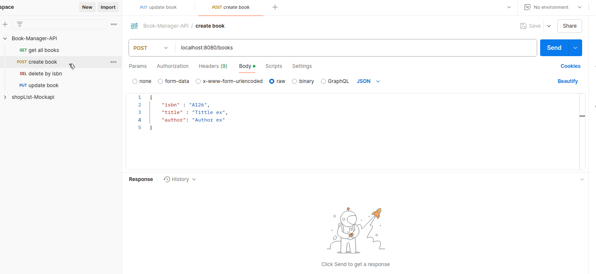

# Book-Manager-API

Este proyecto consiste en una API para gestionar libros, basada en una versión anterior de la misma aplicación implementada en consola. La implementación aplica el patrón Repository utilizando una base de datos en memoria, y se construyó utilizando el framework Spring Boot para simplificar el desarrollo de la API.

## Descripción del Proyecto

El objetivo principal del proyecto es aprender y aplicar conceptos clave del desarrollo de software, como la arquitectura basada en patrones de diseño, específicamente el patrón Repository, y el desarrollo de APIs RESTful utilizando Spring Boot. Esta API permite realizar operaciones CRUD (Create, Read, Update, Delete) sobre una colección de libros almacenados temporalmente en memoria.

### Características

**Operaciones CRUD:**
- Crear un libro.
- Ver todos los libros.
- Actualizar la información de un libro existente.
- Eliminar un libro utilizando su ISBN.

**Arquitectura basada en el patrón Repository:**
- Separación clara entre las capas de persistencia (almacenamiento en memoria) y la lógica de negocio.
- Flexibilidad para reemplazar la implementación en memoria con otra como bases de datos.

**Uso de Spring Boot:**
- Simplificación de la configuración y desarrollo de la API.
- Gestión de dependencias mediante Spring Boot.

**Controladores:**
- Implementación de Controllers para manejar las peticiones HTTP de los clientes.
- Respuestas claras con códigos de estado HTTP (200 OK, 404 Not Found, etc.).

## Aprendizajes

Durante el desarrollo de este proyecto, aprendí y reforcé los siguientes conceptos:
1. Uso de anotaciones como @RestController, @GetMapping, @PostMapping, @PutMapping, y @DeleteMapping para definir los puntos finales.
2. Gestión de respuestas HTTP y estructura de controladores.
3. Implementé una clase InMemoryBookRepository que encapsula las operaciones CRUD sobre una lista en memoria.
4. Uso de Optional para manejar posibles valores nulos de manera más segura.
5. Organización clara entre las capas de la aplicación (Controlador, Repositorio, Modelo).

## Cómo Ejecutar el Proyecto

1. **Clona este repositorio:**

``` 
    git clone https://github.com/LayGomez/Book-Manager-API 
    cd Book-Manager-API 
```  

2. Compila y ejecuta la aplicación con tu IDE preferido (Eclipse, IntelliJ).

3. **Prueba los endpoints:**

    Usa herramientas como Postman para interactuar con la API.
    Endpoints disponibles:
   - GET /books: Lista todos los libros.
   - GET /books/{isbn}: Recupera un libro por su ISBN.
   - POST /books: Crea un nuevo libro.
   - PUT /books/{isbn}: Actualiza la información de un libro.
   - DELETE /books/{isbn}: Elimina un libro por su ISBN.



## Tecnologías Utilizadas


   **Lenguaje:** Java version 21.

   **Framework:** Spring Boot.

   **Almacenamiento:** En memoria.

   **Gestión de dependencias:** Maven.
   
